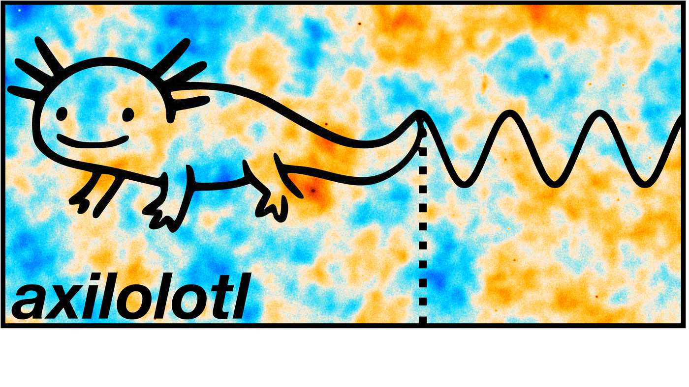

<p align="center">
  
</p>

`axilotl` is a halo-model code that computes angular power spectra for patchy dark screening -- the conversion of CMB photons into axions or dark photons the ionized gas of dark-matter halos. Theoretical and observational details are provided in the following references:
* [arXiv:2307.15124](https://arxiv.org/abs/2307.15124)
* [arXiv:2405.08059](https://arxiv.org/abs/2405.08059) 
* [arXiv:2406.02546](https://arxiv.org/abs/2406.02546)
* [arXiv:2409.10514](https://arxiv.org/pdf/2409.10514)

Note that the code hasn't been optimized and isn't particularly fast. This is partly because there is  no need for a fast dark-screening code, but, *more importantly*, is consistent with the code's namesake.
Indeed, according to ChatGPT, "Axolotls aren't particularly fast swimmers since they
rely on their feathery gills and tail for slow movement. While there's no
precise measurement of their "top speed," axolotls generally swim at speeds
between 1-2 body lengths per second when moving quickly, such as during
feeding or escape responses. For a typical axolotl that's about 20 cm long,
this translates to approximately 20-40 cm per second (0.2-0.4 m/s) under
normal circumstances. They are better adapted for stealth and ambush
predation than for speed."

## What it computes

Given a halo-model backend (mass function, bias model, concentration, linear
power spectrum from [`hmvec`](https://github.com/msyriac/hmvec)), a gas
density profile, and a magnetic-field model (not needed for dark photons), `axilotl` builds the
resonant-conversion optical depth `tau_ell(z, M)` for axion-photon oscillations or
photon-dark-photon mixing and can compute the following power spectra:

- `Cl_TT`  — dark-screening temperature auto-spectrum
- `Cl_Tg`  — dark-screening temperature x galaxy cross-spectrum
- `Cl_gg`  — galaxy auto-spectrum 

Built-in components:
- **Gas profiles**: `BattagliaGas` (Battaglia+12), `NFWGas`
- **Magnetic fields**: `ConstantB`, `CallableB`, or an IllustrisTNG-measured
  `B(r)` built from `axilotl.tng_bfield` (spline-interpolated over 4
  redshift bins x 8 halo-mass bins; see `data/TNG_profiles/`)
- **HOD**: standard 5-parameter central/satellite model (`HODModel`),
  configurable to match e.g. Kusiak+22/23 unWISE conventions, with a
  choice of halo mass definition (`mass_def='vir'` or `'200c'`)

## Install

```bash
git clone git@github.com:samgolds/axilotl.git
cd axilotl
pip install -e .
```

An editable install (`-e`) is recommended: `axilotl` locates its bundled
data (`data/TNG_profiles/`) relative to the cloned repo, so keeping the
package pointed at the source tree (rather than copied into
`site-packages`) is what you want here. Once installed, `import axilotl`
works from anywhere — no manual `PYTHONPATH` needed.

## Quick start

```python
import numpy as np
from scipy.interpolate import CubicSpline
from axilotl import (
    Cosmology, HaloModelBackend, BattagliaGas, ConstantB,
    ScreeningModel, HODModel, GalaxyKernel, ScreeningKernel, Cl_Tg,
)

cosmo = Cosmology(H0=67.32, ombh2=0.0224, omch2=0.1201)
ell_range = np.unique(np.logspace(0, np.log10(4000), 100).astype(int))
backend = HaloModelBackend(cosmo, ell_range, z_min=0.01, z_max=1.5, Nz=30,
                            Mvir_min=1e11, Mvir_max=1e15, NM=30)

gas = BattagliaGas(fb=cosmo.fb)
Bfield = ConstantB(B_muG=1.0, r_lo=0.1, r_hi=1.1)
screening = ScreeningModel(backend, gas, Bfield, dark_comp='axion', nu_GHz=353.0)

z = np.linspace(0, 2, 200)
dndz = CubicSpline(z, np.exp(-((z - 0.6) / 0.25) ** 2))
# 'lambda' is a Python keyword, so the satellite-slope parameter is set via dict
hod_params = {'alpha_s': 1.30, 'sigma_log_m': 0.69,
              'log10_m_min': 12.0, 'log10_m_star': 13.0, 'lambda': 1.0}
hod = HODModel(backend, hod_params, dndz, mass_def='200c')
galaxy = GalaxyKernel(hod)

sk = ScreeningKernel(screening, coupling=1e-11, m_dark_eV=3e-13)
Cl_1h, Cl_2h = Cl_Tg(sk, galaxy)
```

See `examples/compute_templates.py` for a full worked example: it
reproduces the fiducial unWISE-blue x Planck/ACT axion templates from
2409.10514, including the IllustrisTNG magnetic-field model, and writes a
grid of `Cl_Tg(ell)` templates spanning a range of axion masses to
`templates/`.

## Repository layout

```
axilotl/            core package (backend, gas/B-field profiles, screening, spectra)
data/                TNG_profiles/ (IllustrisTNG B(r) measurements), unWISE_dN_dz/
templates/           precomputed Cl_Tg(ell) template grid (unWISE-blue, K22 HOD)
examples/            compute_templates.py — full template-generation example
```
